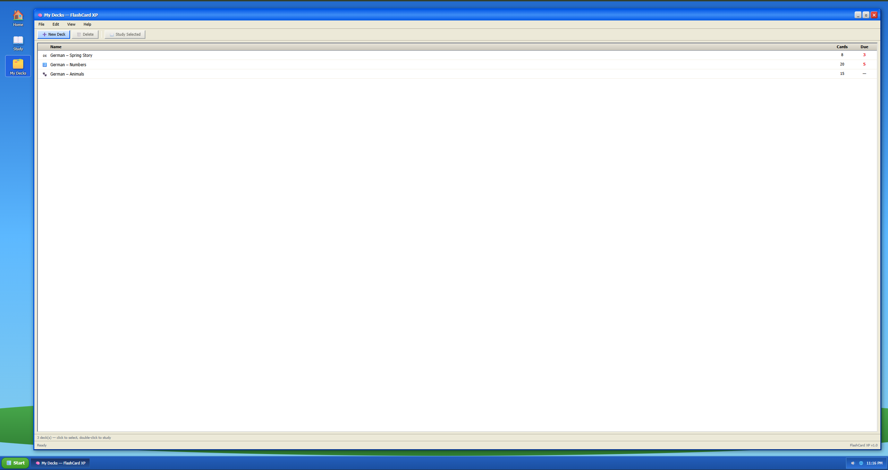
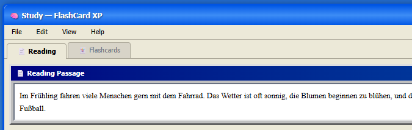
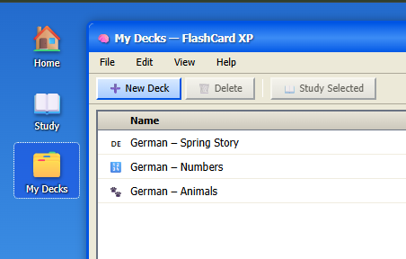

# FlashCard XP


A Windows XP-styled German language flashcard app built with React, TypeScript, Vite, Tailwind CSS, and React Router.

### Windows-XP Styled Components






---

## Features

- **Windows XP UI**: authentic title bars, beveled borders, Start button, taskbar, system tray, and a rolling-hills desktop wallpaper
- **Reading passage**: a draggable in-window German text panel styled as a classic Win32 document window
- **Word selection → card generation**: highlight any word in the passage, hit _Select Word_, then _Generate Card_ to create a flashcard with an English translation
- **3D flashcard flip**: cards animate with a CSS `rotateY` flip to reveal the answer
- **Study session**: work through your saved cards one by one, mark each _Got it_ or _Missed it_, and see your score at the end
- **Deck manager**: a file-explorer-style list of decks with toolbar actions (New, Rename, Delete, Study)
- **React Router navigation**: three routes with desktop icon shortcuts and taskbar indicators

---

## Project Structure

```
src/
├── App.tsx                  # BrowserRouter + route definitions
├── main.tsx                 # React entry point
├── index.css                # Tailwind directives + 3D flip CSS
│
├── components/
│   ├── WindowShell.tsx      # XP chrome: title bar, menu bar, taskbar, desktop
│   ├── Button.tsx           # XP-style push button (default + primary variants)
│   ├── Reader.tsx           # Draggable reading-passage window
│   ├── Select.tsx           # Captures window.getSelection() on click
│   └── Flashcard.tsx        # 3D flip card (front = German, back = English)
│
└── pages/
    ├── Home.tsx             # Welcome screen with stats and navigation
    ├── Study.tsx            # Reading + card generator + study session
    └── Decks.tsx            # Deck list manager with dialog for new decks
```

---

## Getting Started

**Prerequisites:** Node.js 18+

```bash
npm install
npm run dev
```

Then open [http://localhost:5173](http://localhost:5173).

---

## Routes

| Path     | Page  | Description                                          |
| -------- | ----- | ---------------------------------------------------- |
| `/`      | Home  | Welcome screen with stats                            |
| `/study` | Study | Reading passage + card generator + flashcard session |
| `/decks` | Decks | Deck list manager                                    |

Navigate via the desktop icons (double-click) or the big buttons on the Home page.

---

## Component Reference

### `WindowShell`

Wraps every page in the full XP chrome. Renders the desktop wallpaper, desktop icons, the main application window (title bar → menu bar → content → status bar), and the taskbar. Accepts `title` (string) and `children`.

### `Button`

An XP beveled push button. Props: `label`, `onClick`, `disabled`, `variant` (`"default"` | `"primary"`).

### `Reader`

A draggable Win32-style document window containing the German reading passage. Props: `text` (optional override), `title` (optional window title). Text inside is `user-select: text` so words can be highlighted.

### `Select`

Reads `window.getSelection()` when clicked and fires `onSelect(text: string)`. Displays the currently selected word inline.

### `Flashcard`

A perspective-flip card. Props: `front` (German), `back` (English). Click to flip. Uses `transform-style: preserve-3d` + `backface-visibility: hidden` defined in `index.css`.

---

## Styling Approach

All layout and spacing uses **Tailwind utility classes**. The XP-specific aesthetics that Tailwind can't express (beveled `border-color` sequences, gradient backgrounds, system fonts) are applied as inline `style` props. The only global CSS beyond Tailwind directives is the 3D card flip (4 rules in `index.css`).

---

## Tech Stack

| Tool         | Version | Purpose               |
| ------------ | ------- | --------------------- |
| React        | 18      | UI framework          |
| TypeScript   | 5       | Type safety           |
| Vite         | 5       | Dev server + bundler  |
| Tailwind CSS | 3       | Utility-first styling |
| React Router | 6       | Client-side routing   |

### Web Scraper: FastAPI + BeautifulSoup

A backend scraping service that pulls German reading passages and vocabulary from language learning websites, feeding them directly into the app as new study material.

**Planned approach:**

- **FastAPI** endpoint accepts a target URL and optional CSS selector
- **BeautifulSoup** (`bs4`) parses the HTML and extracts clean passage text
- Scraped passages are stored in PostgreSQL and appear in the Reading tab as selectable content
- Frontend gets a new _"Load from Web"_ button in the Reader panel
